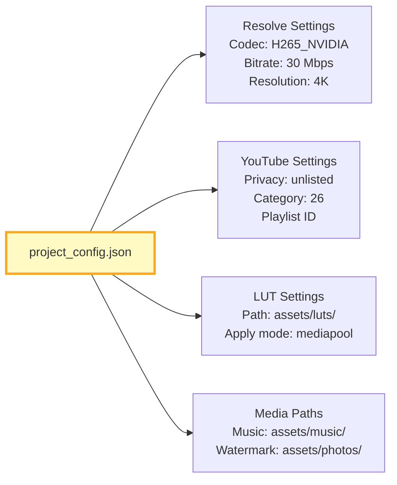

# AI Video Editing Pipeline - Architecture Diagram

## Complete Pipeline Flow

```mermaid
graph TB
    %% Input Stage
    RAW[📹 Raw Video Files<br/>MOV/MP4/MKV<br/>30-60+ minutes]
    
    %% Stage 1: Analysis
    subgraph STAGE1[" 🧠 STAGE 1: AI ANALYSIS "]
        SAMPLE[Frame Sampling<br/>Every 2 seconds]
        
        subgraph CV[Computer Vision Models]
            RESNET[ResNet-50<br/>Feature Extraction<br/>2048-dim vectors]
            CLIP[CLIP ViT-B/32<br/>Semantic Embeddings]
            PHASH[Perceptual Hashing<br/>Duplicate Detection]
        end
        
        subgraph VLM[Vision-Language Model]
            QWEN[Qwen2.5-VL-7B<br/>GGUF Q4_K_M<br/>GPU Accelerated]
            CAPTION[Frame Captioning]
            QUALITY[Quality Rating<br/>1-10 scale]
        end
        
        SCENE_DET[Scene Detection<br/>Visual Transitions<br/>Logical Boundaries]
        CLASSIFY[LLM Classification<br/>Interesting/Moderate/Low/Boring]
        SPEED[Speed Assignment<br/>1x / 2x / 4x / 6x]
        SHOWCASE[Showcase Moment<br/>Detection]
        
        JSON[📄 scene_analysis_*.json<br/>Timestamps, scores, classifications]
    end
    
    %% Stage 2: Extraction
    subgraph STAGE2[" ✂️ STAGE 2: CLIP EXTRACTION "]
        FFMPEG[FFmpeg Processing]
        
        subgraph EXTRACT[Scene Extraction]
            SPEED_ADJ[Speed Adjustment<br/>1x-6x ramping]
            GPU_ENC[GPU HEVC Encoding<br/>NVENC H.265]
            AUDIO_NORM[Audio Normalization]
            FILTER[Filter Boring Scenes<br/>Skip classification]
        end
        
        subgraph TEASE[Showcase Extraction]
            HIGHLIGHT[Top 5-8 Moments]
            CENTER[5-sec clips @ 1x<br/>Centered on peak]
        end
        
        CLIPS[📁 ai_clips/<br/>Extracted MKV clips<br/>Organized by source]
    end
    
    %% Stage 3: Timeline Assembly
    subgraph STAGE3[" 🎬 STAGE 3: TIMELINE GENERATION "]
        TEASER_BUILD[Teaser Assembly<br/>Best showcase clips<br/>Max 45 seconds]
        
        subgraph TIMELINE[Timeline Structure]
            T1[1️⃣ Teaser Section<br/>Showcase highlights]
            T2[2️⃣ Intro Video<br/>Branding/title card]
            T3[3️⃣ Main Content<br/>Deduplicated scenes<br/>Speed-adjusted]
            T4[4️⃣ Outro Video<br/>Call-to-action]
        end
        
        subgraph AUDIO_MIX[Audio Mixing]
            LANE1[Lane 1: Teaser Music<br/>Fade in/out]
            LANE2[Lane 2: Background Music<br/>Full timeline]
            MUTE[Video Audio: -96dB<br/>Effectively muted]
        end
        
        EFFECTS[Visual Effects<br/>Cross-dissolves<br/>Rotation transforms<br/>Watermark @ 70%]
        
        FCPXML[📄 timeline_davinci_resolve.fcpxml<br/>Final Cut Pro XML format]
    end
    
    %% Stage 4: DaVinci Resolve
    subgraph STAGE4[" 🎨 STAGE 4: RESOLVE WORKFLOW "]
        IMPORT[Import Timeline<br/>File → Import → Timeline]
        LUT[Apply LUT<br/>apply_lut_resolve.py<br/>Color grading]
        RENDER[Render Video<br/>render_youtube.py<br/>H.265 NVIDIA<br/>4K @ 30 Mbps]
        
        MP4[📹 Final MP4<br/>4K UHD 3840x2160<br/>H.265 HEVC<br/>30 Mbps bitrate]
    end
    
    %% Stage 5: YouTube Upload
    subgraph STAGE5[" ☁️ STAGE 5: YOUTUBE UPLOAD "]
        AUTH[OAuth 2.0<br/>Brand Account Support<br/>youtube.force-ssl scope]
        THUMB[Thumbnail Processing<br/>Auto-resize 1280x720<br/>Center-crop cover<br/>< 2MB JPEG]
        UPLOAD[Resumable Upload<br/>10MB chunks<br/>Progress indicator]
        META[Metadata & Playlist<br/>Title, description<br/>Category, privacy<br/>Add to playlist]
        
        YT[▶️ YouTube Video<br/>Unlisted/Public<br/>Playlist assigned]
    end
    
    %% Config and Utilities
    CONFIG[⚙️ project_config.json<br/>Render settings<br/>YouTube defaults<br/>LUT paths]
    
    %% Flow connections
    RAW --> SAMPLE
    SAMPLE --> RESNET
    SAMPLE --> CLIP
    SAMPLE --> PHASH
    SAMPLE --> QWEN
    
    RESNET --> SCENE_DET
    CLIP --> SCENE_DET
    PHASH --> SCENE_DET
    
    QWEN --> CAPTION
    CAPTION --> QUALITY
    QUALITY --> CLASSIFY
    
    SCENE_DET --> CLASSIFY
    CLASSIFY --> SPEED
    CLASSIFY --> SHOWCASE
    
    SPEED --> JSON
    SHOWCASE --> JSON
    
    JSON --> FFMPEG
    FFMPEG --> SPEED_ADJ
    SPEED_ADJ --> GPU_ENC
    GPU_ENC --> AUDIO_NORM
    AUDIO_NORM --> FILTER
    
    JSON --> HIGHLIGHT
    HIGHLIGHT --> CENTER
    
    FILTER --> CLIPS
    CENTER --> CLIPS
    
    CLIPS --> TEASER_BUILD
    TEASER_BUILD --> T1
    T1 --> T2
    T2 --> T3
    T3 --> T4
    
    T4 --> LANE1
    T4 --> LANE2
    T4 --> MUTE
    
    LANE1 --> EFFECTS
    LANE2 --> EFFECTS
    MUTE --> EFFECTS
    
    EFFECTS --> FCPXML
    
    FCPXML --> IMPORT
    IMPORT --> LUT
    LUT --> RENDER
    
    CONFIG -.-> RENDER
    CONFIG -.-> AUTH
    
    RENDER --> MP4
    
    MP4 --> AUTH
    AUTH --> THUMB
    THUMB --> UPLOAD
    UPLOAD --> META
    META --> YT
    
    %% Styling
    classDef inputOutput fill:#e1f5ff,stroke:#0288d1,stroke-width:2px
    classDef analysis fill:#fff3e0,stroke:#f57c00,stroke-width:2px
    classDef extraction fill:#f3e5f5,stroke:#7b1fa2,stroke-width:2px
    classDef timeline fill:#e8f5e9,stroke:#388e3c,stroke-width:2px
    classDef resolve fill:#fce4ec,stroke:#c2185b,stroke-width:2px
    classDef youtube fill:#ffebee,stroke:#d32f2f,stroke-width:2px
    classDef config fill:#fff9c4,stroke:#f9a825,stroke-width:2px
    
    class RAW,JSON,CLIPS,FCPXML,MP4,YT inputOutput
    class SAMPLE,RESNET,CLIP,PHASH,QWEN,CAPTION,QUALITY,SCENE_DET,CLASSIFY,SPEED,SHOWCASE analysis
    class FFMPEG,SPEED_ADJ,GPU_ENC,AUDIO_NORM,FILTER,HIGHLIGHT,CENTER extraction
    class TEASER_BUILD,T1,T2,T3,T4,LANE1,LANE2,MUTE,EFFECTS timeline
    class IMPORT,LUT,RENDER resolve
    class AUTH,THUMB,UPLOAD,META youtube
    class CONFIG config
```

## Pipeline Components

### Scripts Mapping

| Stage | Script | Purpose |
|-------|--------|---------|
| **Stage 1** | `analyze_advanced5.py` | AI-powered scene analysis with CV models |
| **Stage 2** | `extract_scenes.py` | FFmpeg-based clip extraction with GPU encoding |
| **Stage 3** | `export_resolve.py` | FCP XML timeline generation with audio/effects |
| **Stage 4** | `render_youtube.py` | DaVinci Resolve API rendering |
| **Stage 4** | `apply_lut_resolve.py` | Optional LUT application utility |
| **Stage 5** | `upload_youtube.py` | YouTube OAuth upload with thumbnails |
| **Orchestrator** | `run_pipeline.py` | Master script (Stages 1-3) |

### Key Technologies

- **AI/ML:** PyTorch, CLIP, Qwen2.5-VL-7B, llama-cpp-python, ResNet-50
- **Video:** FFmpeg, DaVinci Resolve 20 API, NVENC H.265
- **YouTube:** Google API Client, OAuth 2.0, Resumable Upload
- **Formats:** MOV, MP4, MKV (input), FCP XML (timeline), MP4 H.265 (output)

## Data Flow

```mermaid
flowchart LR
    A[Raw Video] -->|2s sampling| B[Frame Analysis]
    B -->|Features + Captions| C[Scene Detection]
    C -->|Timestamps| D[LLM Classification]
    D -->|Speed + Quality| E[JSON Export]
    E -->|Extraction Rules| F[FFmpeg Clips]
    F -->|Timeline Assembly| G[FCP XML]
    G -->|Resolve Import| H[Rendered MP4]
    H -->|OAuth + Metadata| I[YouTube Video]
    
    style A fill:#bbdefb
    style E fill:#fff9c4
    style G fill:#c8e6c9
    style H fill:#ffccbc
    style I fill:#f8bbd0
```

## Performance Metrics

| Metric | Value | Notes |
|--------|-------|-------|
| **Input Duration** | 60 minutes | Typical long-form footage |
| **Output Duration** | 12-18 minutes | 70-80% compression |
| **Analysis Time** | 8-12 minutes | GPU-accelerated inference |
| **Extraction Time** | 5-8 minutes | NVENC H.265 encoding |
| **Timeline Generation** | < 30 seconds | Python + XML generation |
| **Render Time** | 3-5 minutes | 4K H.265 @ 30 Mbps |
| **Upload Time** | 2-4 minutes | Depends on bandwidth |
| **Total Pipeline** | 18-25 minutes | End-to-end automation |

## Configuration Schema

---

**Visualization Notes:**
- Mermaid diagrams render in GitHub, VS Code, and most Markdown viewers
- For best viewing, use a Mermaid-compatible viewer or GitHub preview
- Colors indicate stage groupings (blue=input/output, orange=analysis, purple=extraction, green=timeline, pink=render, red=upload)
