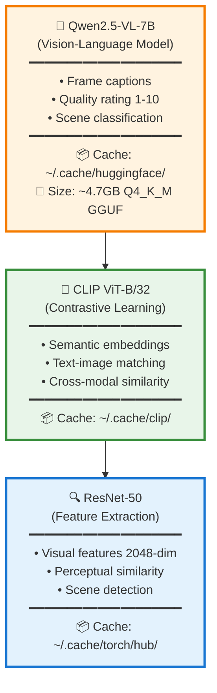
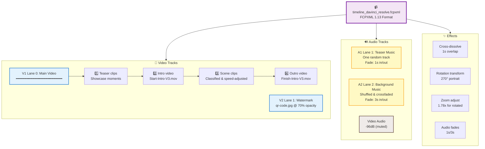

# AI Video Editing Pipeline

## Why This Project Exists

**The Problem:** Creating engaging video content from long-form footage is painfully time-consuming. A typical 60-minute recording requires 4-6 hours of manual editing—watching every frame, identifying interesting moments, cutting boring sections, adjusting speeds, adding music, and polishing transitions. For hobbyists creating scale model builds, DIY projects, or tutorial content, this workload is unsustainable. Videos pile up unedited, creative momentum dies, and content never reaches an audience.

**The Solution:** This AI-powered pipeline compresses weeks of manual editing into minutes of automated processing. By leveraging vision-language models, computer vision, and intelligent scene classification, the system watches your footage for you, identifies what's worth keeping, eliminates dead time, and generates broadcast-ready timelines—complete with music, transitions, and dynamic speed ramping.

**The Value:**
- **Time Savings:** 60 min → 15 min final video in ~20 minutes of processing (vs. 6 hours manual editing)
- **Consistency:** AI applies uniform quality standards across all footage, eliminating subjective editing fatigue
- **Discoverability:** Automatic teaser generation highlights the best moments upfront, boosting viewer retention
- **Scalability:** Process entire video backlogs overnight; edit 10 videos as easily as 1
- **Creative Freedom:** Spend time creating content, not editing it

This pipeline isn't just a tool—it's a force multiplier for solo creators who want to share their work without drowning in post-production.

---

## 🚀 Quick Start - Run Everything in One Command

```bash
# Complete automated pipeline: Raw video → Edited timeline
python run_pipeline.py
```

**What it does:**
1. **Stage 1**: Analyzes all videos with AI (ResNet-50, CLIP, Qwen2.5-VL)
2. **Stage 2**: Extracts scenes and creates speed-adjusted clips
3. **Stage 3**: Generates DaVinci Resolve timeline with music and effects

**Output:** `timeline_davinci_resolve.fcpxml` ready to import into DaVinci Resolve

> 💡 **That's it!** One command processes hours of footage into an edit-ready timeline in ~20 minutes.

---

## Overview

An intelligent video editing automation system that uses computer vision and large language models to analyze, classify, and automatically edit long-form videos into engaging, compressed timelines ready for DaVinci Resolve.

This pipeline transforms lengthy raw footage (30-60+ minutes) into polished, watchable videos by automatically detecting scene quality, adjusting playback speeds, extracting highlight moments, generating professional timelines with music/transitions/watermarks, rendering in DaVinci Resolve, and uploading to YouTube.

**Key Features:**
- AI-powered scene classification (boring, low, moderate, interesting)
- Automated speed ramping (1x-6x) based on content quality
- Showcase moment extraction for teaser sections
- Intelligent duplicate scene detection across multiple videos
- DaVinci Resolve FCPXML timeline generation
- Optional LUT application in Resolve Media Pool
- YouTube rendering (H.265, 4K, bitrate control)
- YouTube upload with OAuth 2.0, playlist support, and thumbnails
- Multi-track audio with background music and teaser soundtracks
- Configurable watermarks with opacity and positioning
- GPU-accelerated video processing (NVENC)

## Pipeline Architecture

```mermaid
graph TB
    %% Input Stage
    RAW[📹 Raw Video Files<br/>MOV/MP4 30-60 min]
    
    %% Stage 1: Analysis
    subgraph S1[" 🧠 STAGE 1: AI ANALYSIS "]
        ANALYZE[analyze_advanced5.py]
        MODELS[ResNet-50 + CLIP + Qwen2.5-VL<br/>Frame sampling every 2s]
        CLASSIFY[Scene Classification<br/>Quality rating 1-10<br/>Speed assignment 1x-6x]
        JSON[scene_analysis_*.json]
    end
    
    %% Stage 2: Extraction
    subgraph S2[" ✂️ STAGE 2: CLIP EXTRACTION "]
        EXTRACT[extract_scenes.py]
        FFMPEG[FFmpeg + NVENC H.265<br/>Speed-adjusted clips<br/>Showcase highlights]
        CLIPS[ai_clips/ folder]
    end
    
    %% Stage 3: Timeline
    subgraph S3[" 🎬 STAGE 3: TIMELINE GENERATION "]
        TIMELINE[export_resolve.py]
        BUILD[Teaser + Intro + Main + Outro<br/>Audio mix + Watermark<br/>Cross-dissolves]
        FCPXML[timeline_davinci_resolve.fcpxml]
    end
    
    %% Stage 4: Resolve
    subgraph S4[" 🎨 STAGE 4: DAVINCI RESOLVE "]
        IMPORT[Import Timeline<br/>File → Import → Timeline]
        LUT[apply_lut_resolve.py<br/>Optional LUT application]
        RENDER[render_youtube.py<br/>H.265 4K @ 30 Mbps]
        MP4[Final MP4]
    end
    
    %% Stage 5: Upload
    subgraph S5[" ☁️ STAGE 5: YOUTUBE UPLOAD "]
        UPLOAD[upload_youtube.py]
        AUTH[OAuth 2.0 + Thumbnail<br/>Playlist + Metadata]
        YT[▶️ YouTube Video]
    end
    
    %% Flow
    RAW --> ANALYZE
    ANALYZE --> MODELS
    MODELS --> CLASSIFY
    CLASSIFY --> JSON
    
    JSON --> EXTRACT
    EXTRACT --> FFMPEG
    FFMPEG --> CLIPS
    
    CLIPS --> TIMELINE
    TIMELINE --> BUILD
    BUILD --> FCPXML
    
    FCPXML --> IMPORT
    IMPORT --> LUT
    LUT --> RENDER
    RENDER --> MP4
    
    MP4 --> UPLOAD
    UPLOAD --> AUTH
    AUTH --> YT
    
    %% Styling
    classDef stage1 fill:#fff3e0,stroke:#f57c00,stroke-width:2px
    classDef stage2 fill:#f3e5f5,stroke:#7b1fa2,stroke-width:2px
    classDef stage3 fill:#e8f5e9,stroke:#388e3c,stroke-width:2px
    classDef stage4 fill:#fce4ec,stroke:#c2185b,stroke-width:2px
    classDef stage5 fill:#ffebee,stroke:#d32f2f,stroke-width:2px
    
    class ANALYZE,MODELS,CLASSIFY,JSON stage1
    class EXTRACT,FFMPEG,CLIPS stage2
    class TIMELINE,BUILD,FCPXML stage3
    class IMPORT,LUT,RENDER,MP4 stage4
    class UPLOAD,AUTH,YT stage5
```



📊 **For detailed component breakdown and performance metrics, see [PIPELINE_DIAGRAM.md](PIPELINE_DIAGRAM.md)**

## Scene Classification System

The AI analyzes video content and assigns classifications that determine playback speed:

| Classification | Speed | Use Case | Description |
|---------------|-------|----------|-------------|
| **Interesting** | 1.0x | Key moments | High-action, critical content, showcase-worthy |
| **Moderate** | 2.0x | Standard content | Average interest, clear context needed |
| **Low** | 4.0x | Background activity | Minor details, setup, transitions |
| **Boring** | 6.0x | Filler content | Repetitive, minimal value (optional skip) |
| **Skip** | N/A | Excluded | Unusable footage (not exported) |

### Compression Example

```
Original Video:    45.3 minutes
├─ Interesting:     1 scene  @1x  →  0.6 min
├─ Moderate:       35 scenes @2x  →  5.2 min
├─ Low:            31 scenes @4x  →  2.4 min
└─ Boring:         12 scenes @6x  →  0.5 min (excluded)
                                    ─────────
Final Timeline:    14.7 minutes     (64% compression)
```

## AI Models and Technologies

### Computer Vision Models



### Analysis Workflow

1. **Frame Sampling**: Extract frames at 2-second intervals
2. **Caption Generation**: Qwen2.5-VL describes visual content
3. **Feature Extraction**: ResNet-50 extracts 2048-dim features
4. **Semantic Encoding**: CLIP generates embeddings
5. **Hash Computation**: Perceptual hashing for scene detection
6. **Scene Segmentation**: Group frames into logical scenes
7. **LLM Classification**: Rate and classify each scene
8. **Speed Assignment**: Map classification to playback speed

## Installation

### Prerequisites

- Python 3.9+
- CUDA-capable GPU (recommended for analysis and encoding)
- FFmpeg with NVENC support
- DaVinci Resolve (for final editing)

### Required Environment (Verified)

- **OS**: Fedora 43 (Workstation)
- **GPU**: NVIDIA GPU with NVENC support
- **RAM**: 32 GB+ recommended (16 GB minimum)
- **Storage**: SSD recommended (20 GB+ free for cache and outputs)
- **DaVinci Resolve**: 20.x (automation verified on 20.0.1)

**Downloads:**
- DaVinci Resolve: https://www.blackmagicdesign.com/support/family/davinci-resolve-and-fusion
- Filmic LUT Pack (iPhone): https://www.filmicpro.com/products/luts/
- Filmic LUT Pack direct download: https://www.filmicpro.com/downloads/Filmic_Pro_deLOG_LUT_Pack_May_2022.zip

### Setup

```bash
# Clone repository and navigate to project directory
cd ~/video

# Create virtual environment
python3 -m venv .venv
source .venv/bin/activate

# Install dependencies
pip install -r requirements.txt

# Download AI models (automatic on first run)
# Models will be cached to ~/.cache/huggingface/ and ~/.cache/clip/

### Python Requirements

All Python dependencies are pinned in [requirements.txt](requirements.txt).
```

### Directory Structure

```
~/video/
├── analyze_advanced5.py          # Stage 1: AI video analysis
├── extract_scenes.py              # Stage 2: Scene extraction
├── export_resolve.py              # Stage 3: Timeline export
├── run_pipeline.py                # Master orchestrator
├── apply_lut_resolve.py           # Optional LUT application in Resolve
├── render_youtube.py              # Render timeline to MP4 (Resolve API)
├── upload_youtube.py              # Upload to YouTube + thumbnail
├── project_config.json            # Configuration file
├── assets/
│   ├── Start-Intro-V3.mov        # Intro video (10-bit)
│   ├── Finish-Intro-V3.mov       # Outro video (10-bit)
│   ├── qr-code.jpg                # Watermark image
│   ├── music-background/          # Background music (WAV)
│   └── music-teaser/              # Teaser music (WAV)
├── ai_clips/                      # Extracted scene clips
│   └── {video_stem}/
│       ├── *_scene_*.mov
│       └── *_showcase_*.mov
└── timeline_davinci_resolve.fcpxml # Final timeline
```

## Usage

### Complete Automated Pipeline (Recommended)

```bash
# Run the full pipeline - analyze, extract, and generate timeline
python run_pipeline.py

# Output: timeline_davinci_resolve.fcpxml + ai_clips/ folder
```

This orchestrates all three stages automatically:
- **Stage 1**: AI analysis of all videos in current directory
- **Stage 2**: Scene extraction with speed adjustments
- **Stage 3**: Timeline generation with music, transitions, and effects

### Post-Pipeline Steps

After `run_pipeline.py` completes, import and render in DaVinci Resolve:

```bash
# 1. Import timeline to DaVinci Resolve
#    File → Import → Timeline → timeline_davinci_resolve.fcpxml

# 2. Apply LUTs (optional)
python apply_lut_resolve.py --config project_config.json

# 3. Render from DaVinci Resolve
python render_youtube.py --output ~/Videos/output.mp4

# 4. Upload to YouTube (uses project_config.json defaults)
python upload_youtube.py --video ~/Videos/output.mp4
```

### Manual Stage-by-Stage Execution

If you prefer to run stages individually:

```bash
# Stage 1: Analyze video (generates scene_analysis_*.json)
python analyze_advanced5.py --video INPUT.MOV

# Stage 2: Extract clips (creates ai_clips/ directory)
python extract_scenes.py --analysis-dir . --output-dir ai_clips

# Stage 3: Export timeline (generates timeline_davinci_resolve.fcpxml)
python export_resolve.py --config project_config.json \
                         --analysis . \
                         --video-dir . \
                         --clips-dir ai_clips \
                         --output timeline_davinci_resolve.fcpxml
```

### Command-Line Options

#### analyze_advanced5.py

```bash
--video PATH              # Input video file
--sample-interval SECS    # Frame sampling rate (default: 2)
--llm-batch-size N        # LLM processing batch size (default: 10)
--gpu                     # Enable GPU acceleration
```

#### extract_scenes.py

```bash
--config PATH             # Project config file
--analysis-dir PATH       # Directory with scene_analysis_*.json
--video-dir PATH          # Source video directory
--output-dir PATH         # Output directory for clips
--exclude-boring          # Skip boring scenes during extraction
```

#### export_resolve.py

```bash
--config PATH             # Project config file
--analysis PATH           # Analysis JSON or directory
--video-dir PATH          # Source video directory
--clips-dir PATH          # Extracted clips directory
--output PATH             # Output FCPXML file
--use-rendered            # Use pre-rendered clips (default)
--use-original            # Use original videos with speed changes
--exclude-boring          # Exclude boring scenes from timeline
--dedupe                  # Remove duplicate scenes across videos
--hash-threshold N        # Hamming distance for deduplication (default: 6)
```

## Configuration

### project_config.json

```json
{
  "paths": {
    "input_dir": "./",
    "output_dir": "./",
    "clips_dir": "./ai_clips",
    "timeline": "./timeline_davinci_resolve.fcpxml"
  },
  "analysis": {
    "sample_interval": 2,
    "target_output_ratio": 0.15,
    "max_speed_multiplier": 8.0,
    "captioning": {
      "enabled": true,
      "model": "Qwen/Qwen2.5-VL-3B-Instruct",
      "device": "cuda"
    }
  },
  "pipeline": {
    "dedupe": false,
    "hash_threshold": 6,
    "use_rendered": true,
    "exclude_boring": true
  },
  "timeline": {
    "intro_clip": "./assets/Start-Intro-V3.mkv",
    "outro_clip": "./assets/Finish-Intro-V3.mkv",
    "teaser_enabled": true,
    "teaser_max_duration": 45.0,
    "exclude_boring": true,
    "rotation_zoom": 1.78,
    "transition_duration": 1.0,
    "watermark": {
      "path": "./qr-code.jpg",
      "position": {"x": 3059.0, "y": -890.0},
      "transparency": 0.3
    },
    "background_music": {
      "folder": "./assets/music-background",
      "audio_lane": 2,
      "fade_duration": 3.0
    },
    "snippet_audio_volume_db": -96
  },
  "audio": {
    "teaser_music": {
      "folder": "./assets/music-teaser",
      "audio_lane": 1,
      "fade_duration": 1.0
    }
  },
  "youtube": {
    "channel_url": "https://www.youtube.com/@modernhackers",
    "upload_title": "Scale Model Car Build",
    "default_description": "...",
    "category_id": "26",
    "default_privacy": "unlisted",
    "made_for_kids": false,
    "altered_content": false,
    "default_playlist_id": "PLxxxxxxxxxxxxxxxxx"
  }
}
```

### Configuration Options

| Section | Key | Description | Default |
|---------|-----|-------------|---------|
| `pipeline` | `exclude_boring` | Skip boring scenes globally | `true` |
| `pipeline` | `use_rendered` | Use pre-rendered clips | `true` |
| `pipeline` | `dedupe` | Remove duplicate scenes | `false` |
| `timeline` | `teaser_enabled` | Include teaser section | `true` |
| `timeline` | `teaser_max_duration` | Teaser length (seconds) | `45.0` |
| `timeline` | `rotation_zoom` | Zoom factor for rotated clips | `1.78` |
| `timeline` | `transition_duration` | Cross-dissolve duration | `1.0` |
| `watermark` | `transparency` | Watermark transparency (0-1) | `0.3` |
| `background_music` | `fade_duration` | Music fade in/out (seconds) | `3.0` |

## Output Format

### Timeline Structure



### Import to DaVinci Resolve

1. **Import Media First**:
   ```
   File → Import Media
   - Select all files in ai_clips/*/ directories
   - Include Start-Intro-V3.mkv and Finish-Intro-V3.mkv
   - Add music files from assets/music-*
   - Add watermark image (qr-code.jpg)
   ```

2. **Import Timeline**:
   ```
   File → Import → Timeline → Import AAF/EDL/XML
   - Select timeline_davinci_resolve.fcpxml
   - Verify all media is linked (no red clips)
   ```

3. **Verify Settings**:
   - Timeline resolution: 3840x2160 (4K)
   - Frame rate: 24 fps
   - Audio channels: Stereo (48kHz)
   - Color space: Rec. 709

## Performance Optimization

### GPU Acceleration

The pipeline uses GPU acceleration at multiple stages:

- **Analysis**: CUDA for model inference (Qwen, CLIP, ResNet)
- **Extraction**: NVENC for hardware video encoding
- **Speed**: 3-5x faster than CPU-only processing

### Disk Space Requirements

```
Input Videos:      ~10GB (45 min @ 1080p)
Analysis Data:     ~50MB (JSON + embeddings)
Extracted Clips:   ~3GB (pre-rendered with speed)
AI Model Cache:    ~6GB (one-time download)
                   ─────
Total:             ~19GB per project
```

### Processing Time Estimates

| Stage | Duration | GPU | CPU-Only |
|-------|----------|-----|----------|
| Analysis (45 min video) | Pass 1 | 5 min | 20 min |
| Analysis (45 min video) | Pass 2 | 3 min | 8 min |
| Extraction (79 scenes) | GPU Encode | 8 min | 25 min |
| Timeline Export | XML Gen | 5 sec | 5 sec |
| **Total** | | **16 min** | **53 min** |

## Troubleshooting

### Common Issues

**Issue**: Missing AI models on first run
```bash
# Solution: Models download automatically
# Check cache: ls -lh ~/.cache/huggingface/hub/
```

**Issue**: NVENC encoding fails
```bash
# Solution: Falls back to CPU (libx265)
# Check GPU: nvidia-smi
# Verify NVENC: ffmpeg -encoders | grep nvenc
```

**Issue**: DaVinci Resolve shows red clips
```bash
# Solution: Import media before timeline
# Verify paths in FCPXML match actual file locations
```

**Issue**: Watermark opacity incorrect
```bash
# Solution: Set transparency in config (0.0-1.0)
# 0.3 transparency = 70% opaque
```

**Issue**: YouTube upload fails or shows 0% in Studio
```bash
# Solution: Use resumable upload (default) and keep the terminal open
# Large files take time to process in Studio after upload completes
```

**Issue**: Thumbnail rejected or stretched
```bash
# Solution: Use upload_youtube.py thumbnail support (auto-resize to 1280x720)
# Provide --thumbnail or place images in assets/photos/
```

**Issue**: Timeline too long/short
```bash
# Solution: Adjust exclude_boring setting
# Enable: 59% compression (excludes boring)
# Disable: 64% compression (includes all)
```

## Advanced Features

### Teaser Section

Automatically creates a 30-50 second teaser from:
- Top-rated showcase moments (rating 9-10)
- Interesting scene clips (rating 8+)

Sorted by quality score and limited to `teaser_max_duration`.

### Duplicate Detection

Cross-video deduplication using perceptual hashing:
```bash
python export_resolve.py --dedupe --hash-threshold 6
```

Hamming distance threshold:
- 0-5: Identical/near-identical scenes
- 6-10: Similar scenes (default)
- 11-15: Visually related
- 16+: Different scenes

### Multi-Video Projects

Process multiple videos in one timeline:
```bash
# Analyze all videos
for video in *.MOV; do
    python analyze_advanced5.py --video "$video"
done

# Extract all scenes
python extract_scenes.py --analysis-dir .

# Export combined timeline
python export_resolve.py --analysis . --dedupe
```

## Technical Details

### Video Encoding Settings

**Extraction** (HEVC NVENC):
```
Codec:     HEVC (H.265)
Encoder:   hevc_nvenc
Preset:    p4 (balanced)
Quality:   CQ 23
Container: Matroska (MKV)
Audio:     PCM 16-bit 48kHz stereo
```

**Speed Adjustment**:
```
Video:     setpts=PTS/{speed},fps=24
Audio:     atempo chain (max 2.0 per stage)
```

### FCPXML Format

DaVinci Resolve-compatible FCPXML 1.13 with:
- Asset references (file:// URIs)
- Ref-clip format for original videos
- Asset-clip format for rendered clips
- TimeMap elements for speed changes
- Adjust-transform for rotation/zoom
- Adjust-blend for opacity
- Audio automation for fades

## License

Copyright 2026. All rights reserved.

## Support

For issues, questions, or contributions, please refer to the project documentation or contact the development team.

---

**Version**: 1.0.0  
**Last Updated**: February 8, 2026  
**Platform**: Linux (CUDA required for GPU acceleration)
